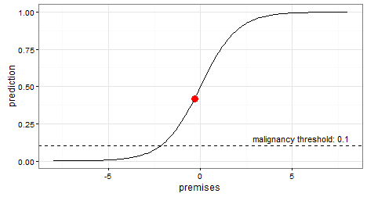

## Why do we bother with ovarian tumors?

1. Recent statistics on ovarian tumors shows that incidence and mortality rates are alarmingly high. For example, annual numbers of new cases and deaths in the USA amount to 22,000 and 14,000 [1].
3. The correct discrimination between ovarian tumors classes (malignant or benign) is crucial to save life of the people.

[1] Siegel, Rebecca, et al. Cancer statistics, 2014. *CA: a cancer journal for clinicians*, 2014, 64.1: 9-29.

--- 

## How we can predict the class of an ovarian tumor?

1. Researchers developed many preoperative models designed for inexperienced gynaecologists. One of them is **LR2** algorithm[2], developed by The International Ovarian Tumor Analysis (IOTA) group. LR2 is a classificator based on a logisic regression method with a cut-off set to 0.1.
4. LR2 takes into account 6 features: age of the patient (years), presence of ascites (yes/no), presence of blood flow within a papillary projection (yes/no), largest diameter of the solid component (mm, at most 50 mm), irregular internal cyst wall (yes/no), presence of acoustic shadows (yes/no).

[2] Timmerman, Dirk, et al. Logistic regression model to distinguish between the benign and malignant adnexal mass before surgery: a multicenter study by the International Ovarian Tumor Analysis Group. *J Clin Oncol.* 2005, 23, 8794-8801.

--- 

## How does LR2 work?

1. Example: a gynaecologist examines a 33-years woman with a diagnosed ovarian tumor; there are no ascites, blood flow within a papillary projection is present, largest diameter of the solid component equals to 25 mm, internal cyst wall is irregular and acoustic shadows are not present. The malignancy prediction is calculated with the chunk of R code:


```r
LR2 = function(age, ascites, blood_flow, solid_component, internal_wall, acoustic_shadow) {    
    z =  -5.3718 + 0.0354 * age + 1.6159 * ascites + 1.1768 * blood_flow + 
          0.0697 * min(solid_component, 50) + 0.9586  * internal_wall - 2.9486 * acoustic_shadow
    return( 1/(1+exp(-z)) )}

val = LR2(33, 0, 1, 25, 1, 0)
print( paste("malignancy character:", ifelse(val>0.1, "malignant", "benign")) )
```

```
## [1] "malignancy character: malignant"
```

--- 

## Where and how a gynaecologist can use LR2?

1. The working online implementation of LR2 algorithm is available at https://andre.shinyapps.io/shinyapp
2. It is easy to use and also draws interactively a logistic regression plot for a given query. Below is a plot for the example on the previous slide:



Enjoy LR2 and fight against cancer!
